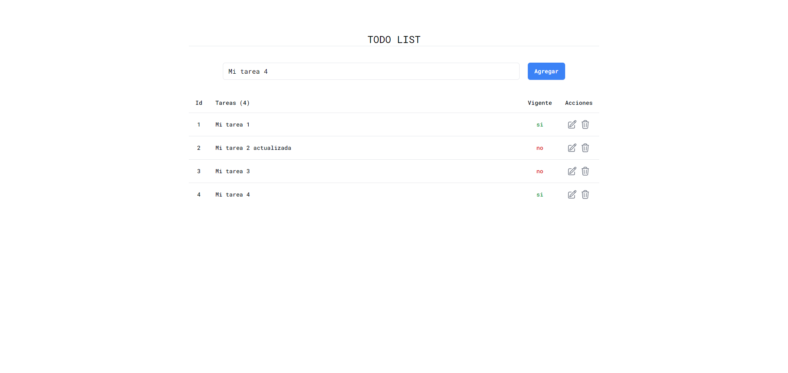
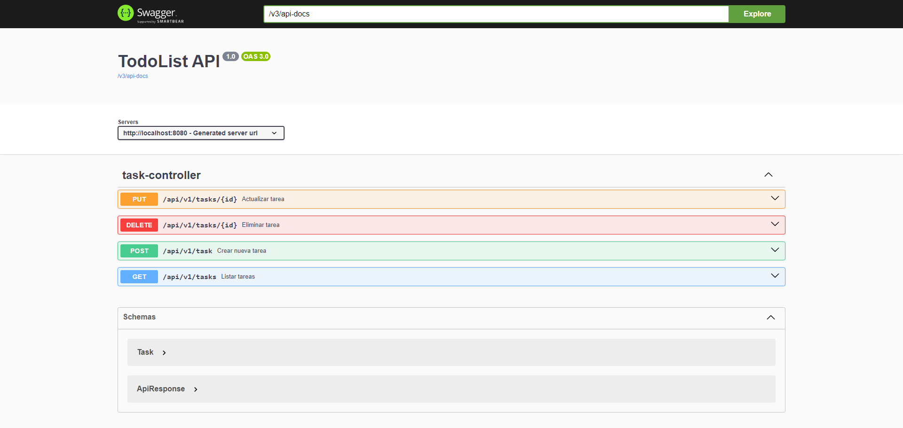

# Test - React + Spring Boot

## Frontend

### Local Environment
- Instalar dependencias: `npm install`
- Levantar servidor local: `npm run dev`
- Ejecutar tests: `npm run test`
- Ir al sitio: `http://localhost:5173`

## Backend

### Local Environment
- Abrir proyecto en [IntelliJ]([https://www.jetbrains.com/es-es/idea/)
- Instalar dependencias y correr aplicación de spring boot
- La aplicación se ejecutará en: `http://localhost:8080`
- Los tests se encuentran en: `backend/src/test`
- Ir a documentación en Swagger: [http://localhost:8080/swagger-ui/index.html#/](http://localhost:8080/swagger-ui/index.html#/)
